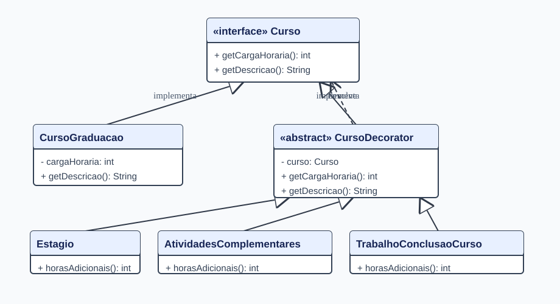

# Decorator

Exercício de Arquitetura de Software. Um curso de graduação recebe etapas opcionais, com acréscimo de horas e descrição, sem alterar a classe base. As etapas podem ser combinadas em qualquer ordem.

## Executar

`mvn test`

Exemplo: `new Estagio(new AtividadesComplementares(new CursoGraduacao(1000)))` retorna 1200 horas e `Graduação / Atividades complementares / Estágio`. O modelo segue o exemplo didático do [professor](https://github.com/marcoaparaujo/padroes-projeto), com horas fixas e validação próprias.
